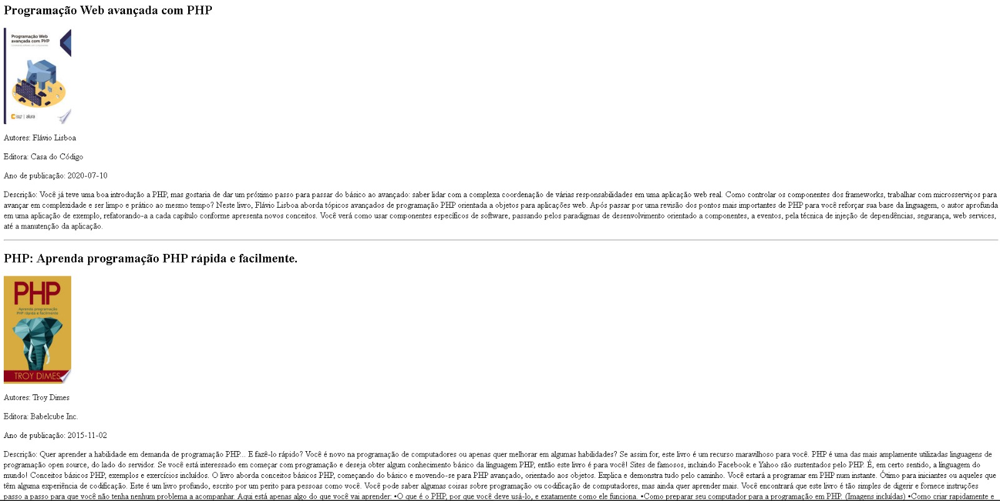

<h1 align="center"> Book search engine with consuming Google Books📕</h1>

This application is a online food menu, where users can place their order and send it directly to the fast food WhatsApp
. 100% responsive app for any devices.

    
    

# Technologies

                
<h2>How the application works?🚀</h2>

<h4>Prerequisites</h4>

- Wamp installed in your machine OR
- XAMP

<h4>Install project</h4>

git clone https://github.com/arthurdavidonisrd/Tech_Books_API.git
 

after clone the project paste, place it in the "htdocs" paste inside your XAMP or WAMP.

 

Run your apache and access "localhost/"name_of_your_paste"

<h4>Project Result</h4>

<h2>Searching for some book:</h2>

<h2>result of the API being consumed:</h2>

<h2>Project Purpose</h2>

learn about API consumption in the PHP language, in this case using a free API from the "Google developers" platform.

